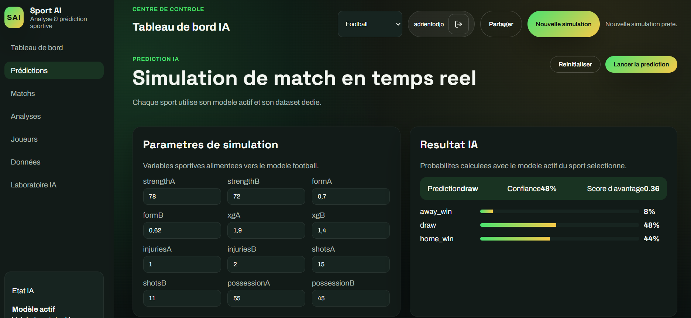
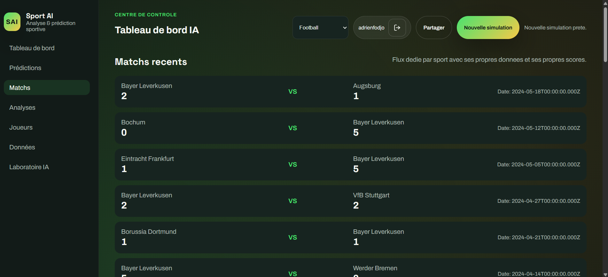
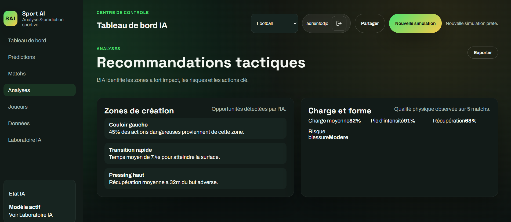
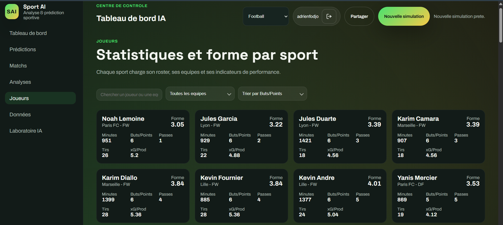
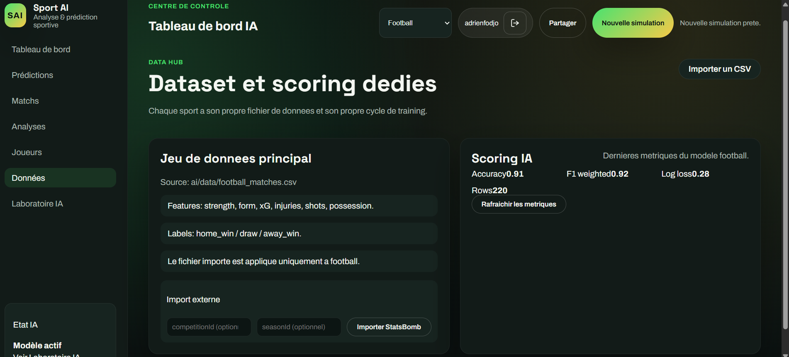
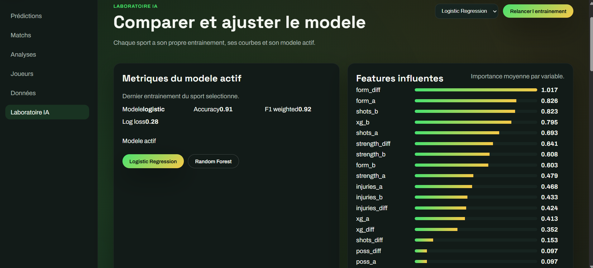
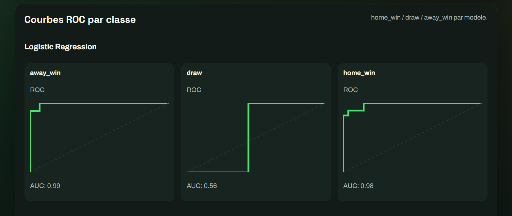
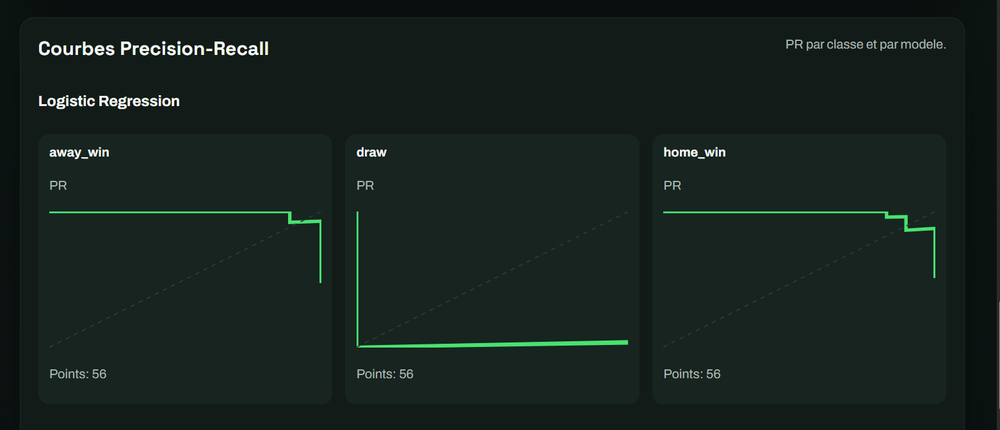
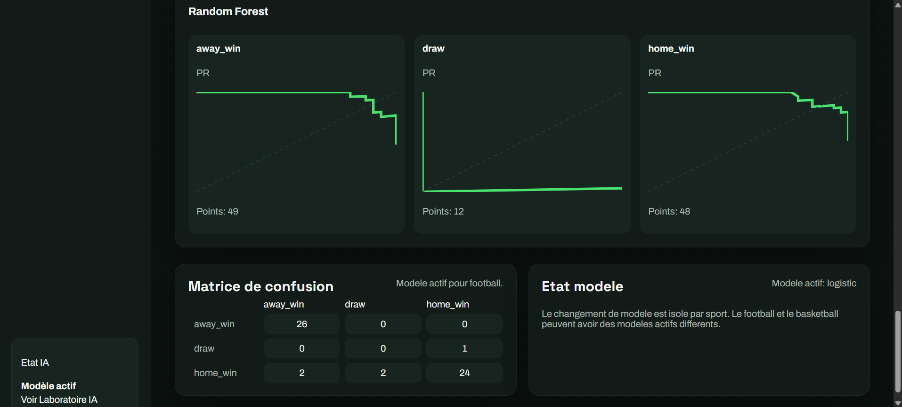

# Sports AI – Multi-Sport Performance Analysis & Prediction

Sports AI est un projet d'intelligence artificielle permettant d'analyser et de prédire les performances sportives à partir de données historiques.

Le système supporte plusieurs sports collectifs et individuels :

- Football
- Rugby
- Handball
- Basketball
- Tennis

L'objectif est d'utiliser des techniques de **data science et de machine learning** pour analyser les performances des équipes et joueurs et prédire les résultats des matchs.

---

# Objectifs du projet

- analyser les statistiques sportives
- prédire les résultats des matchs
- comparer les performances des équipes
- explorer les données sportives avec des techniques de machine learning

---

# Technologies utilisées

- Python
- Pandas
- NumPy
- Scikit-learn
- Matplotlib
- Jupyter Notebook
- Javascript
- Node.js

---

# Méthodes utilisées

Le projet utilise plusieurs approches de machine learning :

- Logistic Regression
- Random Forest
- Gradient Boosting
- Analyse statistique

Ces modèles sont entraînés sur des données historiques afin d’identifier des patterns et prédire les performances futures.

---

# Structure du projet

```
SPORT-AI/
│
├── ai/
│   ├── data/
│   │   ├── football_matches.csv
│   │   ├── basketball_matches.csv
│   │   ├── rugby_matches.csv
│   │   ├── handball_matches.csv
│   │   ├── tennis_matches.csv
│   │   └── matches.csv
│   │
│   ├── models/
│   │
│   ├── ingest_statsbomb.py
│   ├── train.py
│   ├── training.py
│   ├── service.py
│   ├── requirements.txt
│   └── README.md
│
├── backend/
├── web/
├── mobile/
├── docs/
│
├── .gitignore
├── package-lock.json
└── README.md
```
---

# Exemple d'analyse

Le système peut par exemple :

- analyser la performance d'une équipe sur plusieurs saisons
- comparer les statistiques entre deux équipes
- prédire la probabilité de victoire d'un match

Exemple :


predict_match("Team A", "Team B")


Résultat :


Probability Team A win : 62%
Probability Team B win : 38%
## Example Prediction




## Example matchs analysés football




## Example Analyses football




## Example statisques joueurs




## Example Data Hub




## Example Laboratoire IA







---

# Objectif académique

Ce projet a été développé dans le cadre de ma formation en **informatique et intelligence artificielle** afin d'explorer l'utilisation du machine learning dans l'analyse de données sportives.

---


